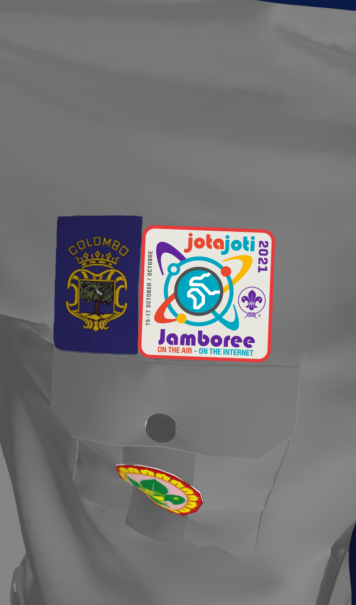

# Inspection

The Patrol stands infront of their gateway, patrol gadget. Instructor comes and stay in the middle. PL alerts the patrol, takes one step forward and salutes as an acknowledgement. Says nothing.

The instructor salues and put them to at-ease. Check the whole patrol one by one and alerts before dismissing the APL to fall out in order to continue inspection procedure.

Same scenario for dismissing. PL does not turn and salute, instead he waits them to dismiss, salutes after them and join the end of the patrol right after the APL, continue to march.

Colombo Scout Badge must be centered aligned with SLSA badge. The Badge should touch the pocket sleeve and should not be overlapped. This colombo Scout badge must be center aligned only if a Camporee or another badge is not present. If a camporee badge is present, the colombo badge must be removed and left aligned making room for the camporee badge to be stitched. In this scenario, Colombo District badge must be at the right pocket sleeve corner and should not cross the pocket sleeve sewing limit. Reference images are shown below.

&#x20;

<figure><figcaption>
Center Aligned
</figcaption></figure>

<figure><figcaption>
Left Aligned (user Perspective)
</figcaption></figure>
